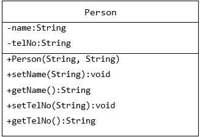
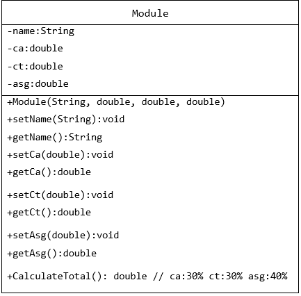

# Week 2

## Question 1

1. A list is required to store the names and phone numbers of the contacts in a mobile phone. A sample of the main menu is shown below: 

    <br>
    
    ```
    ---------------- Main Menu -------------------
    [1] List the phone numbers
    [2] Add a new contact
    [3] Remove a contact  
    [4] Search for a phone number 
    [0] Exit 
    ----------------------------------------------
    Enter your option : __
    ``` 

    <br>

    1. Identify and list the operations required for the application 
    2. Specify the operations of the ```List``` ADT.
    3. Implement the operations of the ```List``` ADT.
    
<br>

2. Write the application program to use the ```List``` ADT to store the names and phone numbers and allow the user to perform the following operations:

    <br>

    - List all the names and the phone numbers.
    - Add a new contact.
    - Remove a contact.  
    - Search for a phone number.

    <br>

    

<br> 

3. In the same application, create a ```List``` ADT to store ```Module``` objects. The application adds 3 ```Module``` objects to the list and calculates the total for all the objects.

<br>

<p align="center">
    
</p>


